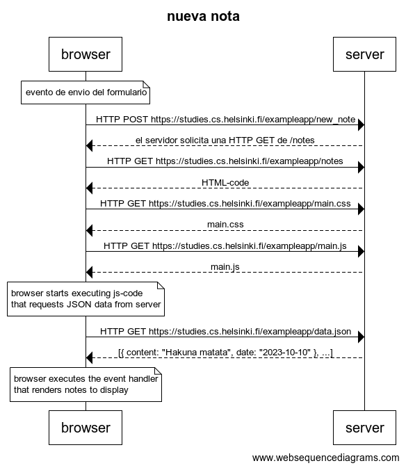
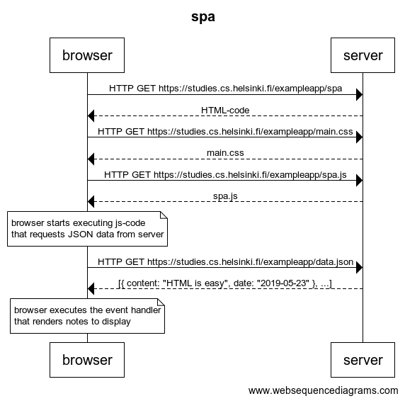
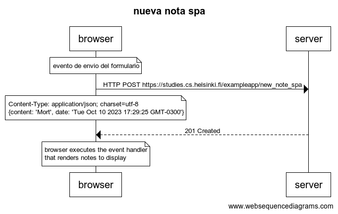

[Fundamentos de las aplicaciones Web](https://fullstackopen.com/es/part0/fundamentos_de_las_aplicaciones_web)


## Ejercicios 0.1.-0.6.

#### 0.1: HTML

#### 0.2: CSS

#### 0.3: Formulario HTML

#### 0.4: nueva nota
[websequencediagrams](https://www.websequencediagrams.com/)
```
title nueva nota

note over browser:
evento de envio del formulario 
end note
browser->server: HTTP POST https://studies.cs.helsinki.fi/exampleapp/new_note
server-->browser: el servidor solicita una HTTP GET de /notes
browser->server: HTTP GET https://studies.cs.helsinki.fi/exampleapp/notes
server-->browser: HTML-code
browser->server: HTTP GET https://studies.cs.helsinki.fi/exampleapp/main.css
server-->browser: main.css
browser->server: HTTP GET https://studies.cs.helsinki.fi/exampleapp/main.js
server-->browser: main.js

note over browser:
browser starts executing js-code
that requests JSON data from server 
end note

browser->server: HTTP GET https://studies.cs.helsinki.fi/exampleapp/data.json
server-->browser: [{ content: "Hakuna matata", date: "2023-10-10" }, ...]

note over browser:
browser executes the event handler
that renders notes to display
end note
```

#### 0.5: Aplicación de una sola página

```
title spa

browser->server: HTTP GET https://studies.cs.helsinki.fi/exampleapp/spa
server-->browser: HTML-code
browser->server: HTTP GET https://studies.cs.helsinki.fi/exampleapp/main.css
server-->browser: main.css
browser->server: HTTP GET https://studies.cs.helsinki.fi/exampleapp/spa.js
server-->browser: spa.js

note over browser:
browser starts executing js-code
that requests JSON data from server 
end note

browser->server: HTTP GET https://studies.cs.helsinki.fi/exampleapp/data.json
server-->browser: [{ content: "HTML is easy", date: "2019-05-23" }, ...]

note over browser:
browser executes the event handler
that renders notes to display
end note
```


#### 0.6: Nueva nota

```
title nueva nota spa

note over browser:
evento de envio del formulario 
end note
browser->server: HTTP POST https://studies.cs.helsinki.fi/exampleapp/new_note_spa
note over browser:
Content-Type: application/json; charset=utf-8
{content: 'Mort', date: 'Tue Oct 10 2023 17:29:25 GMT-0300'}
end note
server-->browser: 201 Created 

note over browser:
browser executes the event handler
that renders notes to display
end note
```
